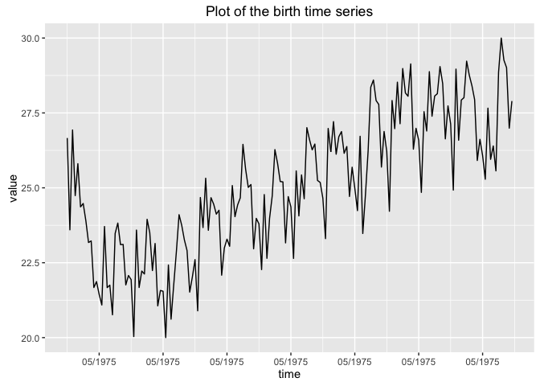
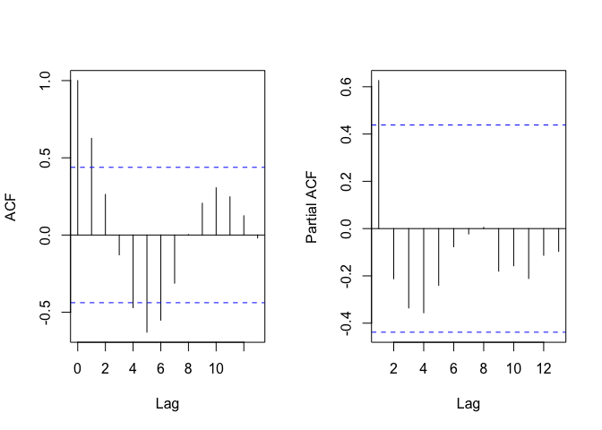

# TimeSeries
JJ Crosskey  
July 6, 2016  


## A test run with time series in R
Investigate time series in R. Also look at linear regression with autocorrelated observations and/or errors.
This example uses Google's stock price. <span style="color:red">*xts*</span> package was used to create the time-series object.


```r
library(readr)
library(ggplot2)
library(PerformanceAnalytics)
library(car)
# "file -I file_name" found the file encoding
stock <- read.delim("google_stock.txt",fileEncoding = "utf-16le", header=TRUE, sep="",as.is = T)
head(stock)
```

```
##        date  price
## 1  2/7/2005 196.03
## 2  2/8/2005 198.64
## 3  2/9/2005 191.58
## 4 2/10/2005 187.98
## 5 2/11/2005 187.40
## 6 2/14/2005 192.99
```

```r
stock$date <- as.Date(stock$date,format="%m/%d/%Y")
ts.stock <- xts(stock$price,stock$date)
```

Plot the time series data, and the (partial) autocorrelation function with different lags. ACF(autocorrelation function) is the correlation coefficient between two values in a time series: $Corr(y_t, y_{t-k})$. PACF (partial autocorrelation function) meaures the association between $y_t$ and $y_{t-k}$, filtering out the influence of the random variables in between.


```r
plot.xts(ts.stock, main="Google stock price")
```

 autocorrelation functions-1.png)

```r
par(mfrow=c(1,2))
acf.stock <- acf(ts.stock,main="")
pacf.stock <- pacf(ts.stock,main="")
```

 autocorrelation functions-2.png)

```r
head(acf.stock$acf)
```

```
## [1] 1.0000000 0.9792486 0.9590517 0.9353768 0.9117531 0.8862082
```

```r
head(pacf.stock$acf)
```

```
## [1]  0.979248605  0.003017053 -0.094816590 -0.013271837 -0.052582151
## [6] -0.007837009
```

Both plots and values of the *pacf* indicate that AR(1) is likely to be a good model for this dataset.

### Plot time series with ggplot2

```r
births <- scan("http://robjhyndman.com/tsdldata/data/nybirths.dat")
ts.births <- ts(births,frequency = 12, start = c(1946,1))
df.births <- data.frame(time=c(time(ts.births)), value=c(ts.births))
df.births$time <- as.Date(df.births$time)
ggplot(df.births, aes(time, value)) + geom_line() + scale_x_date(date_labels = "%m/%Y") + ggtitle("Plot of the birth time series")
```



## Testing autocorrelation
### Durbin-Watson test for residual autocorrelation

The function `durbinWatsonTest` or `dwt` in the **car** package is used to compute residual autocorrelations and generalize Durbin-Watson statistics and their boostrapped p-values. 


```r
blaisdell <- read.delim("blaisdell.txt",fileEncoding = "utf-16le", header=TRUE, sep="",as.is = T)
lm.blaisdell <- lm(comsales~indsales,data=blaisdell)
dwt.blaisdell <- durbinWatsonTest(lm.blaisdell)
dwt.blaisdell
```

```
##  lag Autocorrelation D-W Statistic p-value
##    1       0.6260046     0.7347256       0
##  Alternative hypothesis: rho != 0
```

```r
# We'll also treat the residuals as time series and look into the (P)ACF
ts.res <- ts(lm.blaisdell$residuals)
par(mfrow=c(1,2))
acf(ts.res, main="")
pacf(ts.res,main="")
```



Both Durbin-Watson test and the plot of ACF and PACF suggest that there is strong correlation between the error terms.

### Ljung-Box Q test (aka portmanteau test)


```r
Ljung.test <- Box.test(lm.blaisdell$residuals,type = "Ljung")
Ljung.test
```

```
## 
## 	Box-Ljung test
## 
## data:  lm.blaisdell$residuals
## X-squared = 9.0752, df = 1, p-value = 0.002591
```

The $\chi^2$ test statistic value is 9.08, with df (lag=k=1) of 1, p-value is 0.0026. This corroborates the conclusion that there is strong lag-1 autocorrelation.

## Methods to remedy the autocorrelation between the error terms in linear regression

1. Make sure a key predictor is not omitted 
2. Transformations on the variables

### Cochrane-Orcutt procedure

The idea is to transform variables until the residuals do not have strong autocorrelation any more, and transform the estimates back to their original scale. Using Bleisdell data as an example, this procedure is illustrated below. From above we already know that there is strong autocorrelation between the residuals, so we'll start with regress the residuals against the lag-1 residuals to find an estimate of the slope for the Cochrane-Orcutt transformation.


```r
res.blaisdell <- lm.blaisdell$residuals
res1.blaisdell <- c(NA,res.blaisdell[1:19])
res.lm <- lm(res.blaisdell~res1.blaisdell-1) # regress residuals wrt the lag 1 residuals, without intercept
rho <- as.numeric(res.lm$coefficients)
```

|Note: The lag series/vector can also be more easily obtained by the _zoo_ object as follows:
|zres <- zoo(res.blaisdell)
|zres_lag1 <- lag(zres,k=1,na.pad=TRUE)


Next we'll transform the variables as such: $y^*_t = y_t - \rho y_{t-1}$ and $x^*_t = x_t - \rho x_{t-1}$. After which we'll do regression on the transformed variables and investigate the residuals again. Here the Durbin-Watson test is used.


```r
trans.blaisdell <- data.frame(comsales=blaisdell$comsales[2:20] - rho*blaisdell$comsales[1:19], indsales=blaisdell$indsales[2:20] - rho*blaisdell$indsales[1:19])
trans.lm <- lm(comsales~indsales, data = trans.blaisdell)
trans.lm
```

```
## 
## Call:
## lm(formula = comsales ~ indsales, data = trans.blaisdell)
## 
## Coefficients:
## (Intercept)     indsales  
##     -0.3941       0.1738
```

```r
dwt.trans <- durbinWatsonTest(trans.lm)
dwt.trans
```

```
##  lag Autocorrelation D-W Statistic p-value
##    1       0.1473569      1.650248   0.304
##  Alternative hypothesis: rho != 0
```

Durbin-Watson test suggests that there is no evidence that the error terms are correlated under the model of transformed variables. Therefore we'll transform the model coefficients back to the original scale:


```r
beta_0 <- trans.lm$coefficients[1]/(1-rho)
beta_1 <- trans.lm$coefficients[2]
beta_0
```

```
## (Intercept) 
##   -1.068524
```

```r
beta_1
```

```
##  indsales 
## 0.1737583
```

Therefore the regression model for the original data is __comsales = -1.068524 + 0.1737583 * indsales__.

One thing to note about the Cochrane-Orcutt approach is that it does not always work properly. This occurs primarily because if the errors are positively autocorrelated, then r tends to underestimate ρρ. When this bias is serious, then it can seriously reduce the effectiveness of the Cochrane-Orcutt procedure. See [ref](https://onlinecourses.science.psu.edu/stat501/node/360).


### Hildreth-Lu Procedure

This procedure is similar to the previous transformation. Instead of iteratively trying different $\rho$ values, it chooses a series of candidate values and pickes the one that minimizes the SSE. It's used after establishing the AR(1) model choice.

### First Difference Procedure

This procedure uses $\rho = 1$ in the previous two procedures. The estimates from this regression are transformed back by setting
$$\hat{\beta_j} = \hat{\beta_j}^*,   j = 1, \cdots, p-1$$
$$\hat{\beta}_0 = \bar{y} - (\hat{\beta}_1\bar{x}_1 + \cdots + \hat{\beta}_{p-1}\bar{x}_{p-1})$$
