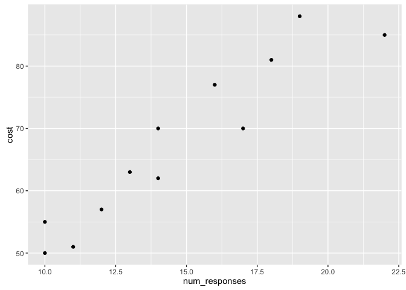
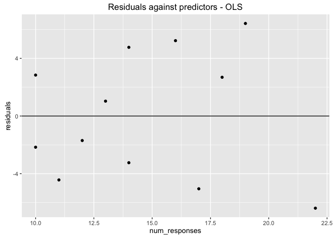
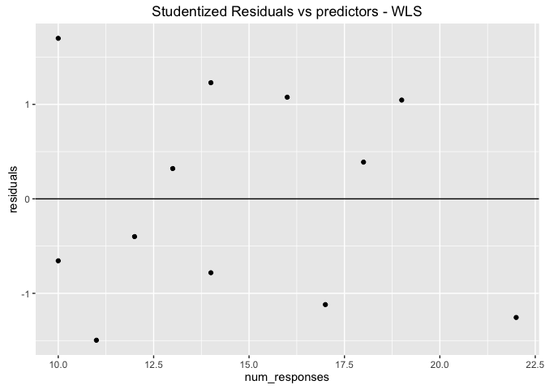

# Weighted Least Squares in Linear Regression
JJ Crosskey  
July 1, 2016  


### An example

This is an example illustrating how to determine weights used in weighted least squares in linear regression when the errors do not display constant variance. Details about this example can be found [here](https://onlinecourses.science.psu.edu/stat501/node/397).

#### Load data into R
The data was collected from a study of computer-assisted learning by n = 12 students.


```r
library(readr)
library(ggplot2)
# "file -I file_name" found the file encoding
cs <- read.delim("ca_learning_new.txt",fileEncoding = "utf-16le", header=TRUE)
head(cs)
```

```
##   id num_responses cost
## 1  1            16   77
## 2  2            14   70
## 3  3            22   85
## 4  4            10   50
## 5  5            14   62
## 6  6            17   70
```

```r
ggplot(data=cs, mapping=aes(y=cost, x=num_responses)) + geom_point()
```



The plot of cost vs. number of responses shows that there is a linear relationship between the two measured variables.

#### Linear regression with OLS (ordinary least squares)

```r
cs.lm <- lm(cost~num_responses,data=cs)
summary(cs.lm)
```

```
## 
## Call:
## lm(formula = cost ~ num_responses, data = cs)
## 
## Residuals:
##    Min     1Q Median     3Q    Max 
## -6.389 -3.536 -0.334  3.319  6.418 
## 
## Coefficients:
##               Estimate Std. Error t value Pr(>|t|)    
## (Intercept)    19.4727     5.5162   3.530  0.00545 ** 
## num_responses   3.2689     0.3651   8.955 4.33e-06 ***
## ---
## Signif. codes:  0 '***' 0.001 '**' 0.01 '*' 0.05 '.' 0.1 ' ' 1
## 
## Residual standard error: 4.598 on 10 degrees of freedom
## Multiple R-squared:  0.8891,	Adjusted R-squared:  0.878 
## F-statistic: 80.19 on 1 and 10 DF,  p-value: 4.33e-06
```

```r
cs.res <- resid(cs.lm) # residuals
ggplot(mapping=aes(x=cs$num_responses, y=cs.res)) + geom_point() + geom_hline(yintercept = 0)+ ggtitle("Residuals against predictors - OLS") + xlab("num_responses") + ylab("residuals")
```



The plot of the residuals versus the predictor values indicates possible nonconstant variance since there is a very slight "megaphone" pattern.

Weighted least squares will be used to address this possiblity. The weights will be based on regressing the absolute residuals versus the predictor. The weights are defined as 1 over the squared fitted values.


```r
res.lm <- lm(abs(cs.res)~cs$num_responses)
summary(res.lm)
```

```
## 
## Call:
## lm(formula = abs(cs.res) ~ cs$num_responses)
## 
## Residuals:
##     Min      1Q  Median      3Q     Max 
## -2.2578 -0.5977  0.3300  1.0134  1.7866 
## 
## Coefficients:
##                  Estimate Std. Error t value Pr(>|t|)  
## (Intercept)       -0.9049     1.6611  -0.545   0.5979  
## cs$num_responses   0.3226     0.1099   2.935   0.0149 *
## ---
## Signif. codes:  0 '***' 0.001 '**' 0.01 '*' 0.05 '.' 0.1 ' ' 1
## 
## Residual standard error: 1.385 on 10 degrees of freedom
## Multiple R-squared:  0.4628,	Adjusted R-squared:  0.409 
## F-statistic: 8.614 on 1 and 10 DF,  p-value: 0.01492
```

```r
fitted_vals <- predict.lm(res.lm, data.frame(num_responses=cs$num_responses))
weights <- 1/(fitted_vals)^2
```


```r
cs.wls <- lm(cost~num_responses,data=cs,weights = weights)
ggplot(mapping=aes(x=cs$num_responses, y=rstudent(cs.wls))) + geom_point() + geom_hline(yintercept = 0)+ ggtitle("Studentized Residuals vs predictors - WLS") + xlab("num_responses") + ylab("residuals")
```



A plot of the **studentized residuals** versus the predictor values when using the weighted least squares method shows how we have corrected for the megaphone shape since the studentized residuals appear to be more randomly scattered about 0.
